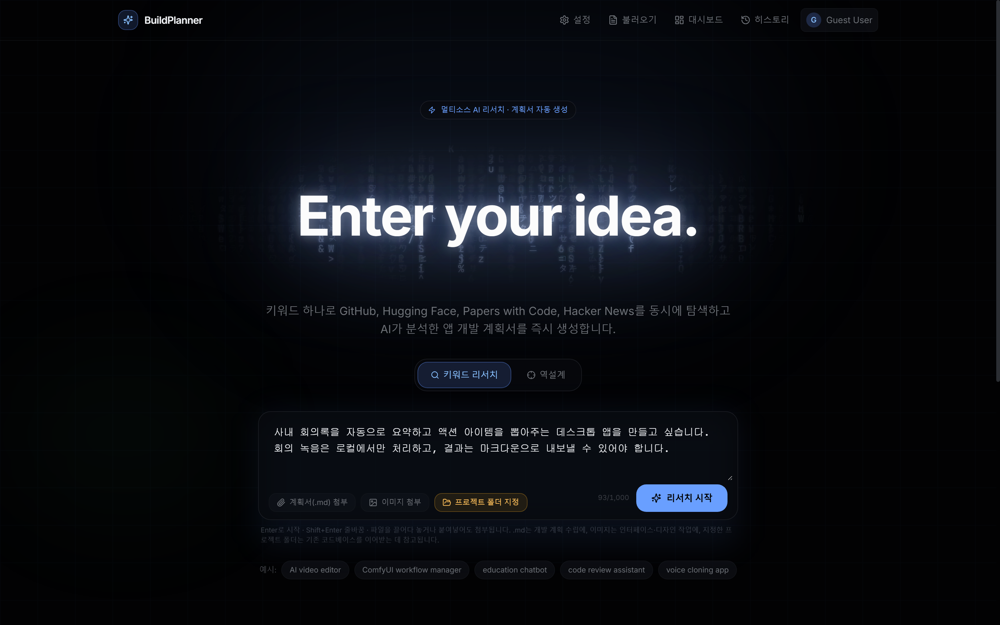
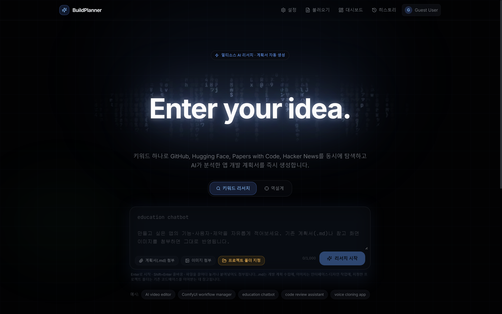
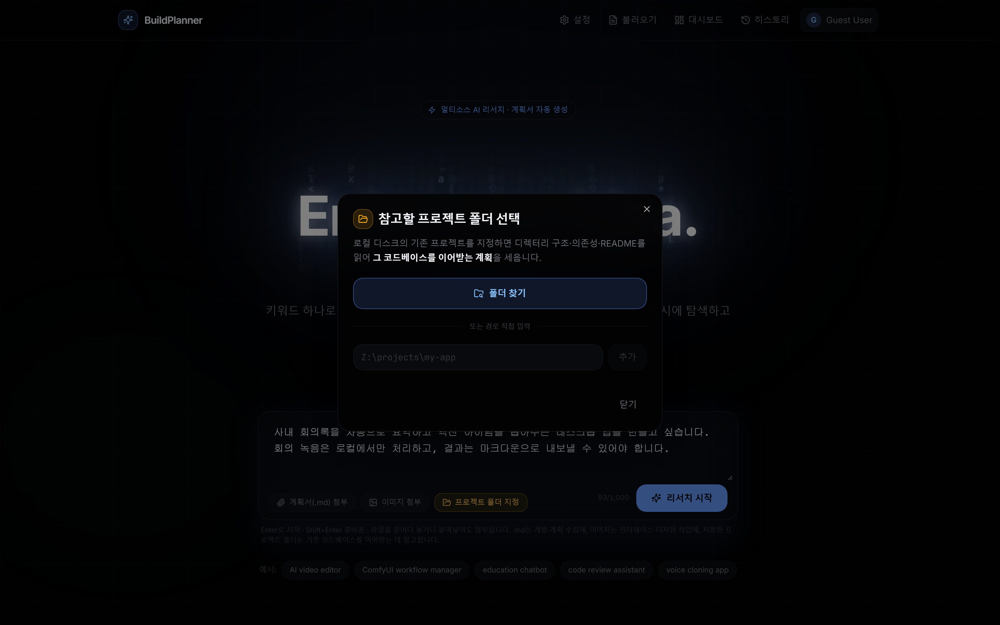
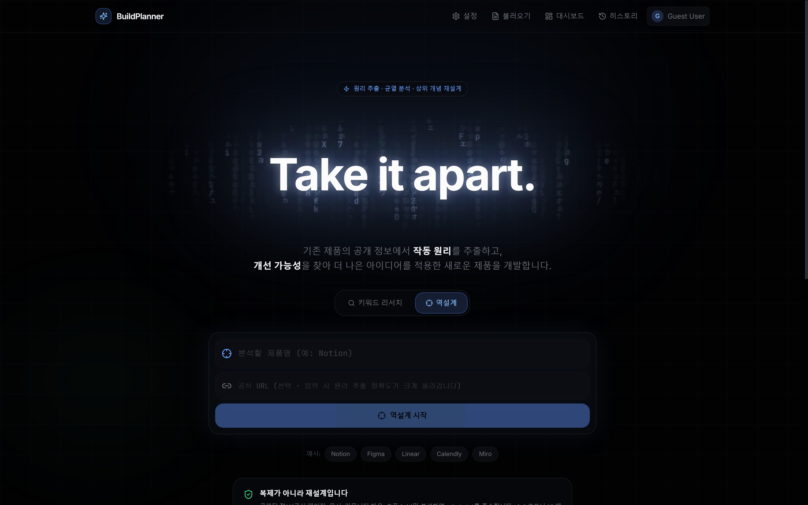

# BuildPlanner

**아이디어 한 줄에서, 코딩 에이전트가 바로 돌릴 수 있는 프로젝트 폴더까지.**

키워드 하나로 GitHub · Hugging Face · Papers with Code · Hacker News를 동시에 훑고,
LLM이 그 결과를 앱 개발 계획서로 정리한 다음, 그 계획서를 **Spec + Loop 구조의 개발 킷(.zip)** 으로 내보냅니다.
압축을 풀어 Claude Code / Codex / Gemini CLI 에 폴더째 열어주면 그날 바로 개발이 시작됩니다.



---

## 무엇을 하는 도구인가

| | |
|---|---|
| 🔍 **멀티소스 리서치** | 4개 플랫폼을 병렬로 수집하고 스타·다운로드·최신성·커뮤니티 반응으로 점수화합니다. |
| 🧠 **LLM 분석** | 핵심 기술, 구현 난이도, 라이선스 리스크, 기술 스택, 개발 단계를 구조화된 JSON으로 뽑습니다. |
| 📄 **계획서 자동 생성** | 12개 섹션의 Markdown 계획서를 즉시 내려받습니다. |
| 📎 **자료 첨부** | 기존 기획서(.md)는 계획 수립에, 화면 이미지는 UI/디자인 지침 도출에 반영됩니다. |
| 📁 **로컬 프로젝트 참조** | 내 PC의 기존 코드베이스를 지정하면 그 스택·구조·규칙을 **이어받는** 계획을 세웁니다. |
| 🎯 **역설계 모드** | 기존 제품의 작동 원리를 추출하고 개선 가능성을 찾아 더 나은 아이디어의 새 제품을 설계합니다. |
| 📦 **개발 킷 (.zip)** | 계획서를 스펙·루프·컨텍스트 폴더 구조로 변환해 에이전트가 자율 반복하도록 만듭니다. |
| 🔄 **주기적 갱신** | 매일/매주 새 소스를 델타 수집해 계획서를 자동 업데이트합니다. |

---

## 화면

### 아이디어 입력

긴 설명을 그대로 적고, `.md` 기획서와 참고 화면 이미지, 그리고 참고할 로컬 프로젝트 폴더를 함께 붙입니다.



### 참고 프로젝트 폴더 지정

기존 코드베이스를 지정하면 디렉터리 구조·의존성·README를 읽어 **처음부터 만드는 계획이 아니라 이어받는 계획**을 세웁니다.



### 역설계 모드



---

## 개발 킷 (.zip) 구조

리서치가 끝난 뒤 **개발 킷 (.zip)** 버튼을 누르면, 사용 중인 에이전트에 맞춰 폴더가 만들어집니다.

```
my-app/
├─ CLAUDE.md            # 에이전트가 세션 시작 시 자동으로 읽는 프로젝트 메모리
├─ loop/
│  ├─ GOAL.md           # WHAT + DONE 조건 (HOW는 지시하지 않음)
│  ├─ PROGRESS.md       # 프로젝트의 기억 — 매 반복마다 읽고, 매 반복 끝에 기록
│  ├─ RALPH.md          # 반복 1회분 프롬프트
│  └─ EVALUATOR.md      # Generator ⇄ Evaluator 독립 검증 절차
├─ specs/
│  ├─ INDEX.md          # 스펙 목록 + TODO/DOING/DONE 상태
│  └─ SPEC-001.md …     # 기계적으로 확인 가능한 Acceptance Criteria
├─ context/             # architecture · tech-stack · risks · references · local-projects
├─ docs/                # 원본 계획서, 첨부 문서
├─ assets/references/   # 참고 이미지 (디자인 기준)
└─ scripts/loop.sh|ps1  # 자율 루프 러너
```

선택한 에이전트에 따라 메모리 파일과 커맨드가 자동으로 바뀝니다.

| 에이전트 | 메모리 파일 | 추가 파일 |
|---|---|---|
| Claude Code | `CLAUDE.md` | `.claude/commands/loop.md`, `.claude/agents/evaluator.md` |
| OpenAI Codex | `AGENTS.md` | `prompts/loop.md` |
| Gemini CLI | `GEMINI.md` | `.gemini/commands/loop.toml` |
| Cursor | `AGENTS.md` | `.cursor/rules/*.mdc` |

---

## 빠른 시작 (내 PC에 설치)

```bash
git clone https://github.com/<your-account>/buildplanner.git
cd buildplanner
pnpm install
cp .env.example .env      # Windows: copy .env.example .env
pnpm dev                  # http://localhost:3000
```

**LLM 키는 `.env`에 넣지 않아도 됩니다.** 앱 우측 상단 **[설정]** 에서 Gemini 또는 OpenAI 키를 입력하면
브라우저 로컬 저장소에만 보관되고 요청 헤더로 전달됩니다.

MySQL을 연결하지 않으면 인메모리 저장소로 동작합니다(재시작 시 초기화). 영구 보관하려면:

```bash
# .env 에 DATABASE_URL 설정 후
pnpm db:push
```

---

## 웹에서 바로 사용하기

이 앱은 Express + tRPC **서버가 필요**합니다. GitHub Pages 같은 정적 호스팅으로는 동작하지 않습니다.
대신 두 가지 방법이 있습니다.

### 1) GitHub Codespaces — 설치 없이 브라우저에서 (권장)

저장소에서 **Code ▸ Codespaces ▸ Create codespace** 를 누르면 컨테이너가 뜨고 의존성이 자동 설치됩니다.

```bash
pnpm dev     # 3000 포트 미리보기가 자동으로 열립니다
```

[.devcontainer/devcontainer.json](.devcontainer/devcontainer.json) 이 포함되어 있어 별도 설정이 필요 없습니다.
컨테이너는 내 계정 소유라 로컬 폴더 참조 기능도 그대로 쓸 수 있습니다(경로 직접 입력 방식).

### 2) 컨테이너로 아무 호스트에나 배포

```bash
docker build -t buildplanner .
docker run -p 3000:3000 -e JWT_SECRET=$(openssl rand -hex 32) buildplanner
```

Render / Railway / Fly.io 등 Node 컨테이너를 받는 곳이면 그대로 올라갑니다.
방문자가 각자 [설정]에 자기 키를 넣는 구조라 **서버에 API 키를 둘 필요가 없습니다.**

> **공개 배포 전에 꼭 읽어주세요** — 아래 [보안](#보안) 항목의 인증 관련 제약이 있습니다.

---

## 보안

### 1. 인증은 현재 로컬 전용 우회 모드입니다

[`server/_core/sdk.ts`](server/_core/sdk.ts) 의 `authenticateRequest` 는 OAuth를 우회하고 모든 요청을
**동일한 관리자 게스트 사용자**로 인증합니다. 내 PC에서 혼자 쓰는 도구로는 편하지만, 그대로 공개 배포하면
**방문자 전원이 같은 계정을 공유**하고 서로의 리서치를 보게 됩니다.
공개 서비스로 운영하려면 실제 인증을 먼저 붙이세요.

### 2. 로컬 폴더 참조는 서버의 디스크를 읽습니다

"프로젝트 폴더 지정"은 **서버가 실행 중인 머신**의 파일시스템을 스캔하고, Windows에서는 폴더 선택 창을 띄웁니다.
그래서 기본값이 이렇습니다.

| 환경 | 기본 동작 |
|---|---|
| 로컬 개발 (`NODE_ENV != production`) | 켜짐 |
| 프로덕션 빌드 | **꺼짐** (Dockerfile은 `ALLOW_LOCAL_FS=false` 고정) |
| `ALLOW_LOCAL_FS=true` | 명시적으로 켜짐 — 1인용 인스턴스에서만 사용 |

기능이 꺼진 서버에서는 UI에서 버튼 자체가 사라집니다.

### 3. 커밋되지 않는 것들

`.env`, `dist/`, `node_modules/` 는 `.gitignore` 에 있습니다. API 키는 `.env` 또는 브라우저
로컬 저장소에만 존재하며 저장소에는 포함되지 않습니다.

---

## 환경 변수

| 변수 | 필수 | 설명 |
|---|---|---|
| `DATABASE_URL` | 아니오 | MySQL 연결 문자열. 없으면 인메모리 저장소 |
| `GEMINI_API_KEY` / `OPENAI_API_KEY` | 아니오 | 서버 공용 LLM 키. 없으면 사용자가 [설정]에서 각자 입력 |
| `LLM_MODEL` | 아니오 | 모델 지정 (기본: `gemini-2.5-flash` 또는 `gpt-4o-mini`) |
| `JWT_SECRET` | 배포 시 예 | 세션 쿠키 서명 키 |
| `PORT` | 아니오 | 기본 3000 |
| `ALLOW_LOCAL_FS` | 아니오 | 로컬 폴더 참조 기능 강제 on/off |

전체 목록과 설명은 [.env.example](.env.example) 에 있습니다.

---

## 기술 스택

**Frontend** React 19 · TypeScript · Vite 7 · Tailwind CSS 4 · Radix UI · wouter · TanStack Query
**Backend** Node.js · Express · tRPC 11 · Drizzle ORM · MySQL(선택)
**그 외** Vitest · 의존성 없는 자체 ZIP 라이터(Node `zlib` 기반)

---

## 개발

```bash
pnpm dev          # 개발 서버 (Vite HMR + API)
pnpm test         # Vitest (95+ 케이스)
pnpm check        # 타입 검사
pnpm build        # 프로덕션 빌드
pnpm db:push      # 스키마 마이그레이션 생성 + 적용
```

### 구조

```
client/src/        React 앱 (pages, components, hooks)
server/            Express + tRPC
  ├─ collector.ts    멀티소스 수집
  ├─ analyzer.ts     LLM 분석 + 계획서 생성
  ├─ teardown.ts     역설계 4단 체인
  ├─ scaffold.ts     개발 킷 생성
  ├─ projectScan.ts  로컬 프로젝트 스캔 + 폴더 선택 창
  └─ zip.ts          의존성 없는 ZIP 라이터
shared/            클라이언트·서버 공용 스키마
drizzle/           DB 스키마와 마이그레이션
```

---

## 라이선스

[MIT](LICENSE)
